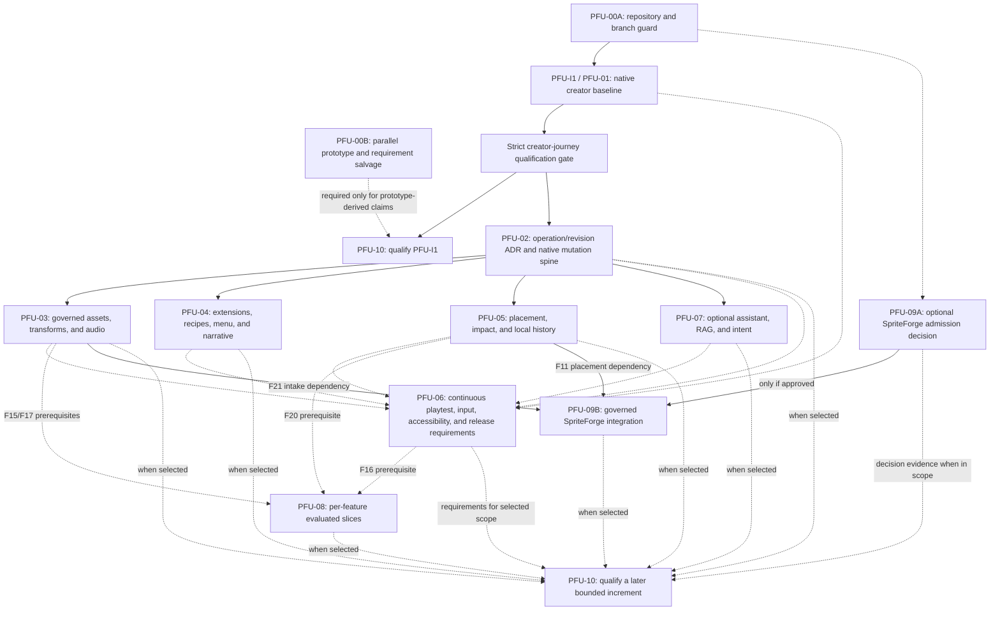

# URPG Product Feature and Usability Native Absorption Plan

> **Status:** Active creator-product execution plan; planning and traceability only until a task is implemented and evidenced.
>
> **Repository:** `G:\URPG Maker-development`
>
> **Source intake:** `docs/external-intake/PRODUCT_FEATURE_USABILITY_ROADMAP.md`
>
> **Last audited:** 2026-07-15

## Goal

Absorb the useful product outcomes from the RPG Maker MZ/Node Creator Hub prototype into the existing native URPG editor and runtime without importing its application architecture, creating a second project authority, or overstating the readiness of bounded native subsystems. This is the sole active creator-product plan: it consolidates the prior cohesion milestones and the native-absorption roadmap.

This plan preserves the source feature IDs `F01`-`F24` and improvement IDs `I01`-`I10` for traceability. `PFU-*` task IDs are the executable work packets; the consolidated M0-M11 milestone mapping below preserves the prior implementation history without creating a second task authority.

## 1. Correction Record

### 1.1 What went wrong

The previous implementation started in `F:\stuff from desktop\URPG - RPG Game Maker`, a non-Git asset/vendor bundle whose own instructions said that no root application existed. The proposed Creator Hub architecture was then mistaken for the URPG product architecture, and a standalone Node application was built under `first_party/creator-hub`.

That was the wrong implementation target. The real product repository already contains a native C++20/ImGui editor, deterministic native runtime, CMake/Ninja build, Catch2 tests, governed asset services, project/session ownership, map authoring, QuickJS compatibility, diagnostics, replay, recovery, and packaging.

| Mistake | Consequence | Required correction |
| --- | --- | --- |
| Repository identity was not verified before editing. | Work was created outside the Git repository and could not be committed with URPG. | Require a repository-root and remote check before every implementation run. |
| A proposed “Creator Hub” was treated as an absent application to build. | A parallel Node/HTML product shell duplicated existing native ownership. | Extend `urpg_editor`, `EditorProjectSession`, and native document owners only. |
| RPG Maker MZ JSON and `plugins.js` were treated as primary product storage. | Prototype services bypassed URPG schemas, dirty state, history, runtime consumers, and packaging rules. | Keep MZ mutation/import under the optional compat/migration boundary. |
| Prototype tests were treated as product progress. | Passing tests proved only self-contained JavaScript behavior, not native reachability or runtime execution. | Translate selected assertions into native Catch2/Python fixtures and actual app-shell evidence. |
| The imported M0-M13 sequence was allowed to compete with the active native M0-M11 plan. | Status and execution authority became ambiguous. | Keep the imported roadmap as provenance and make this a subordinate `PFU-*` plan. |

### 1.2 What exists from the mistaken implementation

A forensic audit found the local prototype intact at `F:\stuff from desktop\URPG - RPG Game Maker\first_party\creator-hub`:

| Evidence | Audited value |
| --- | ---: |
| Total files | 226 |
| Source files | 157 |
| Test files | 63 |
| Total size | 1,162,219 bytes |
| Test cases on 2026-07-14 | 246 passed, 0 failed |
| Runtime | Node.js 22+, ES modules, browser/local development shell |
| Git history in that workspace | None |

The work is not physically lost, but its passing tests are not evidence that URPG implements those features. Its durable value is the behavior vocabulary and fault scenarios: plan/preview/confirm/apply, source-version checks, provenance, deterministic fixtures, rollback, explicit unavailable states, bounded jobs, and release-blocking diagnostics.

The raw prototype must not be copied into `apps/`, `editor/`, `engine/`, or `runtimes/`. It remains a local source for salvage review until its behavior ledger is complete; deletion or archival requires a separate explicit decision.

### 1.3 Repository-lock preflight

Before changing product code, the implementer must verify all of the following from the intended working directory:

```powershell
git rev-parse --show-toplevel
git remote get-url origin
git status -sb
Test-Path AGENTS.md
Test-Path CMakeLists.txt
Test-Path apps/editor
Test-Path engine/core
```

For interactive work on this workstation, the expected current root is `G:\URPG Maker-development`; pass it as `-ExpectedRoot` to enforce that task-local pin. Legitimate clones and CI may live elsewhere when no root is pinned, but they must contain the native markers and use repository identity `DocDamage/URPG-RPG-Game-Designer`, accepting normalized HTTPS or SSH forms of `origin`. Stop if a pinned root or the normalized repository identity does not match; do not create a replacement application around a missing path.

## 2. Planning Authority and Status Language

When documents disagree, use this order for this work:

| Purpose | Authority |
| --- | --- |
| Machine-readable subsystem claims | `content/readiness/readiness_status.json` |
| Release-facing subsystem evidence | `docs/release/RELEASE_READINESS_MATRIX.md` |
| App-level release evidence | `docs/APP_RELEASE_READINESS_MATRIX.md` |
| Current program status | `docs/PROGRAM_COMPLETION_STATUS.md` |
| Current creator execution | This document |
| Broad native capability direction | `docs/NATIVE_FEATURE_ABSORPTION_PLAN.md` |
| This feature absorption work | This document |
| Original MZ/Node proposal | `docs/external-intake/PRODUCT_FEATURE_USABILITY_ROADMAP.md` (reference only) |

This plan uses the following conservative states:

- **Integrate:** substantial native owners exist, but creator-path breadth or release evidence remains open.
- **Extend:** a bounded seed exists, while much of the requested feature still needs native implementation.
- **Defer:** no approved shipping contract exists, or prerequisites/evidence are missing.
- **Compat-only:** the behavior belongs to optional MZ import/execution and is not a native product requirement.
- **Not applicable:** a source defect has no native reproduction and must not become speculative work.

`READY` on a bounded subsystem such as `ui_menu_core`, `accessibility_auditor`, or `export_validator` does not mean the corresponding broad feature F05, F09, or F10 is complete.

## 3. Native Architecture Decisions

1. **One application shell.** `urpg_editor` is the creator product. There is no separate Creator Hub server, website, or Node runtime.
2. **One project authority.** `EditorProjectSession`, native project services, and authoritative document models own open/switch/save/dirty/recovery behavior.
3. **One runtime authority.** Native runtime systems consume native project data. QuickJS is an explicit compatibility/extension lane, not the core gameplay architecture.
4. **One governed asset path.** Discovery, promotion, attachment, relinking, transformation revisions, and packaging extend `engine/core/assets`, `editor/assets`, and `tools/assets`.
5. **Domain-owned mutation.** Preview/apply/inverse behavior must call the responsible native document owner. Generic JSON copies are not authoritative project state.
6. **Shared safety semantics.** Durable changes carry stable IDs, source revisions, validation, creator-readable diagnostics, dirty-state registration, undo/recovery behavior, and atomic persistence.
7. **Contextual editor integration.** Deep tools open from the creator's project/map/object context unless repeated workflow evidence justifies a top-level workspace.
8. **Review-gated intelligence.** AI and procedural suggestions remain optional, bounded, previewable, explicitly approved, reversible, and unable to use raw shell/filesystem authority.
9. **Isolated external tooling.** Heavy ML, media, or generation tooling stays under `tools/` or a supervised adapter and produces reviewed manifests/artifacts for normal native intake.
10. **Truth before promotion.** Compiled models and headless snapshots do not establish WYSIWYG usability, platform qualification, or release readiness.

## 4. Prototype Salvage Disposition

| Prototype family | Portable behavior | Native destination | Disposition |
| --- | --- | --- | --- |
| Hub/project lifecycle, storage, recovery, privacy | Explicit project inspection, safe mode, snapshots, portable archive rules, redacted support previews | `editor/project/*`, `engine/core/project/*`, diagnostics and packaging owners | Translate missing acceptance cases; discard Node shell and stores. |
| Contracts, transaction, command platform, acceptance map | Stable diagnostics, source-version recheck, preview/confirm/apply/undo, evidence-to-requirement mapping | Existing document commands, dirty-state/history, context actions, project audit | Translate the pattern; do not add a competing generic database or transaction journal. |
| Asset intake, transforms, collections, rights, plop | Content hashes, provenance, archive containment, non-destructive revisions, stale-source conflicts | `engine/core/assets/*`, `editor/assets/*`, `tools/assets/*`, map/document commands | Translate behavior and fixtures into native services. |
| Menu, dialogue, quest, localization, captions | Versioned typed data, aggregated validation, preview-before-save, stable localization/voice IDs | Native menu/message/dialogue/quest/localization/audio owners | Translate feature gaps; MZ exporters remain optional compat outputs. |
| Plugin locks, recipes, curated Synrec tests | Non-executing inspection, hashes, dependency diagnostics, typed parameters, rollback | `editor/plugin`, `engine/core/plugin`, `engine/core/mod`, `runtimes/compat_js` | Split native mods from MZ plugins; keep sidecar/`plugins.js` behavior compat-only. |
| Playtest, semantic input, replay, balance, world graph | Bounded state, deterministic traces, reproducible seeds, visible assumptions | Native playtest controller, input, replay, balance, dependency graphs | Translate only after authoritative runtime seams are used. |
| Assistant, RAG, intent, frontier history | Citations, permissions, approval, diffs, reverse patches, bounded plans | `engine/core/ai`, `editor/ai`, `tools/ai`, `tools/retrieval`, native commands | Extend existing native seeds; discard browser/provider/storage duplication. |
| SpriteForge adapter | Admission, loopback isolation, staged results, normal asset intake | Future governed external-tool adapter feeding F21/F11 | Requirements only until source/license/capability review approves a bounded integration. |
| Browser pages/controllers and `node:test` | Accessible labels and explicit disabled states | Native ImGui widgets, panels, snapshots, and manual review | Re-express behavior; never port page/controller code. |

PFU-00B must produce both a readable ledger and a machine-readable companion containing every prototype test name, every detailed source-roadmap requirement, source feature ID, and disposition (`native-test`, `compat-test`, `already-covered`, `bundle-only`, or `discard`). Assign stable requirement IDs such as `F03-R04` where the source document did not provide one. Native/compat/covered rows require a native owner, target fixture/test, and result; bundle-only and discarded rows instead require the retained-boundary or rejection evidence defined below. A passing JavaScript assertion is not checked off until its selected native equivalent passes through an actual URPG owner.

## 5. Feature Reconciliation

### 5.1 Core features F01-F10

| ID | Native state | Existing owners/evidence | Residual native outcome |
| --- | --- | --- | --- |
| F01 Creator Hub | Integrate | `apps/editor/main.cpp`, `editor/project/*`, `engine/core/project/*`, creator-journey tests | Extend the existing shell with all-surface dirty ownership, remaining lifecycle/archive/storage/recovery breadth, truthful health/search/jobs, and safe migration flows. No second Hub. |
| F02 Visual Asset Library | Integrate | `editor/assets/*`, `engine/core/assets/*`, `tools/assets/*`, 100,000-row catalog fixture | Add collections/favorites/comparison, richer facets and preview coverage, governed “use here” actions, and exact undo/history integration. |
| F03 Asset Transformation Studio | Extend | Asset conversion handoff, spritesheet metadata/preview, `tools/sprite_pipeline`, import tooling, and a bounded native atlas-metadata revision manifest | Add pixel-producing crop/slice/scale/palette/atlas/tileset operations incrementally, plus preview, cancellation/inverse/removal behavior, and end-to-end attachment/assignment evidence. |
| F04 Dependency-aware Plugin Manager | Extend | Native plugin manifests/inspection, mod registry/manager, QuickJS plugin manager and tests | Keep native mods and MZ plugins separate; add non-executing discovery, dependency/ordering plans, locks, typed config, trust, support files, save impact, and rollback where each lane owns them. |
| F05 WYSIWYG Menu Studio | Extend | Native menu scene graph, serializer/migration, inspector and preview, bounded core signoff | Add real canvas layout editing, constraints, guides, templates/components, focus-flow preview, drafts/history, failure-safe persistence, runtime round trip, and manual graphical evidence. |
| F06 Gameplay Recipe Gallery | Extend | `GameplayRecipeService`/project document, typed template, runtime profile and panel foundation | Expand the bounded native schema/runtime composition with guided parameters, persistence, broader templates, and domain-owner integration. MZ plugin recipes remain compat-only. |
| F07 Visual Quest and Dialogue Builder | Extend | Native dialogue/quest graphs, schemas, panels, contextual creator project, runtime tests | Complete visual node editing, stable reference pickers, reachability/dead-end validation, localization/voice IDs, undo, migrations, and authored runtime proof. |
| F08 Live Playtest Lab | Integrate | `editor/playtest/playtest_session_controller.*`, runtime diagnostics, recovery, vertical-slice tests | Add bounded state inspectors/mutations, map travel, profiling, reload negotiation, scenario replay, disposable state restore, crash isolation, and exact redacted support bundles. |
| F09 Accessibility and Localization Center | Integrate | Native auditor/adapters, localization models/panel, input remap, bounded signoff | Complete keyboard/controller focus, canvas alternatives, user profiles, pseudo-localization, stale keys, font/glyph/RTL/IME/plural/layout validation, and manual assistive review. |
| F10 Release Assistant | Integrate | Native export validator/packager, preview/diagnostics panels, project audit and release matrices | Aggregate project references, credits/notices/BOMs, plugin/save/update impact, secret/security checks, exact staging, platform qualification, install/repair/update/rollback evidence. |

### 5.2 Advanced features F11-F24

| ID | Native state | Existing owners/evidence | Residual native outcome |
| --- | --- | --- | --- |
| F11 Direct Placement and Smart Prefabs | Extend | Typed asset drag payloads, Map workspace, grid-part commands, attachment service | Extend current immediate Tiles/Props placement and authored Event metadata drops to other contextual targets, stale-source checks, shared history, keyboard parity, event-sprite rendering, and versioned smart prefabs. |
| F12 Embedded Agentic Creator Assistant | Extend; developer-only | AI knowledge/tool registry, approval/diff/revert UI, creator planner, OpenAI-compatible service | Bind tools to authoritative native commands, complete bounded multi-turn tool handling, capability/source-version/secret/budget policy, and optional provider/model packaging qualification. |
| F13 Hybrid Project RAG | Extend; offline foundation | Native lexical knowledge plus `tools/ai` and `tools/retrieval` artifacts | Add per-project cited hybrid retrieval, incremental invalidation, object/path/hash/version identity, deletion propagation, access/license filters, and injection-safe untrusted-data handling. |
| F14 Intent-to-Project Compiler | Extend; early seed | Creator command planner/panel for bounded tile/prop/logic plans | Expand only through approved native commands to maps/events/menus/quests; add locked regions, provenance/cost, preview, validation, rollback, and separately evaluated image/sketch inputs. |
| F15 Multimodal Asset and Style Intelligence | Defer beyond tooling seed | Metadata catalog and offline vision/segmentation tooling | Establish an evaluation corpus before visual embeddings, crop/sketch search, palette/style scoring, explanations, or license-aware recommendations become product work. |
| F16 Autonomous Playtest Agents | Defer beyond strong replay seed | Playtest controller, semantic input foundations, replay recorder/player/gallery, headless tests | Add isolated budgeted explorers/fuzzers/personas that drive real semantic input and emit reproducible state/input/visual evidence. Do not call static graph analysis an agent. |
| F17 Constraint-based Procedural Authoring | Extend | Seeded map generator, procedural toolkit/panel, terrain brush | Add visual constraints, locked regions, selective regeneration, NPC/loot/quest rules, authoritative commands, per-operation review, provenance/versioning, and deterministic runtime proof. |
| F18 Balance and Progression Simulator | Extend | Economy simulator, encounter/balance panels, combat/crafting/progression models | Build canonical-data scenarios, personas/strategies, batches/sensitivity, cliff/dominant-strategy/deadlock diagnostics, and navigation back to source parameters. |
| F19 Project World Graph and Impact Explorer | Extend | Event and grid-part dependency graphs, asset `used_by`, world travel graph | Add one incremental stable-ID project reference view spanning document types, why-included/orphan/impact queries, safe rename/delete plans, external-change handling, and graph UI. |
| F20 Branchable Collaborative Editing | Defer beyond early primitives | Domain undo, snapshots/recovery, local review bundles, AI patches | First establish semantic operation history. Then add named branches, object compare, three-way conflict resolution, dependency-aware selective replay/merge, provenance, and portable exchange. |
| F21 Personal Asset Vault | Integrate | Import session, global library, promotion, attachment, archive, relink, cleanup, asset UI/tooling | Add clipboard/watched intake, collections, durable cancel/resume jobs, explicit custody/portability policy, full transaction/undo integration, and broader format/archive evidence. |
| F22 Unified Input and Controller Platform | Extend | Input core, remap profiles/store, controller binding runtime/panels | Add device polling/hot-plug/ownership, context routing, axes/chords/deadzones/repeat, spatial focus/lint, calibration/recovery, glyphs/haptics, replay integration, and controller-only editor proof. |
| F23 SpriteForge Integration | Defer | No SpriteForge implementation; native sprite pipeline/preview are possible attachment points | Complete source/license/capability admission first. If approved, expose a supervised typed job adapter whose outputs enter F21 and F11; never import its environment, project DB, plugin loader, launcher, or frontend. |
| F24 Audio, Voice, and Caption Studio | Extend | Audio core/mixer/presets/validator, inspector/mix panels, offline audio tools | Add waveform/spectrogram editing, non-destructive trim/fade/gain revisions, loudness/peak/loop QA, take/locale/rights/caption models, assignment, locale/muted-alternative checks, and undo/release integration. |

### 5.3 Improvements I01-I10

| ID | Disposition in native URPG |
| --- | --- |
| I01 Preloader resource lifetime | Adapt the invariant to native cache/loader/thumbnail budgets and M10 performance evidence. Synrec code is not a native implementation target. |
| I02 Preloader correctness/recovery | Audit native priority loader, asset loader, startup services, and runtime preflight for queue/cancellation/terminal-failure gaps; add native tests only for reproduced gaps. |
| I03 Menu Builder portability | Retire the HTML sidecar requirement. Prove native `menu_builder` route/package reachability; unsupported MZ sidecars receive explicit compat diagnostics. |
| I04 Safe menu persistence | Merge into native serializer, shared dirty/save ownership, atomic publication, recovery, and interruption tests. |
| I05 Configuration validation | Merge into menu schemas, inspector/runtime diagnostics, migration, and release preflight. |
| I06 Actor preview correctness | Mark not applicable unless reproduced in the native character/appearance/battle preview; never port a speculative Synrec row/X/Y fix. |
| I07 Typed configuration/restricted scripting | Keep as an invariant. Ordinary native configuration remains typed; advanced scripts stay in the governed QuickJS/extension boundary. |
| I08 Existing editor usability | Merge into parent M1/M4/M7/M10 dirty state, history, recovery, theme, accessibility, performance, and manual UX work. |
| I09 Catalog integrity | Merge into F02/F04/F21 and parent M2/M3/M11 provenance, support-file, license, promotion, attachment, and release gates. Remove bundle-specific record counts. |
| I10 First-party release engineering | The native foundation exists. Residual work is documentation authority, clean-clone/package/platform evidence, and continuing deterministic gate maintenance. |

## 6. Execution Entry, First Increment, and Dependency Order

### 6.1 Implementation entry gate

Before new feature code begins:

1. Resolve the current creator-work baseline by merging the open PR, or explicitly freeze its reviewed HEAD if the PR cannot yet merge. Query live required checks first. A frozen baseline requires every failure to be recorded as a scoped known break with an owner and exit condition; it never converts red CI into passing evidence. Do not accumulate unrelated PFU feature work on that branch.
2. Record whether `main` or `development` is the integration base. At this checkpoint the GitHub default and PR base are `main`, while the local creator branch descends from `development`; a new PFU branch must not guess between them.
3. Create a fresh `agent/<bounded-slice>` branch from the agreed, updated integration base.
4. Run PFU-00A repository identity checks and the narrow baseline for the selected slice before editing.
5. Keep the `F:` prototype intact until PFU-00B records its hash and salvage coverage. PFU-00B runs in parallel with unrelated native PFU-01 work; it blocks prototype cleanup and prototype-derived feature claims, not ordinary creator-plan closure.
6. Do not treat a stale `LastTestsFailed.log` as current evidence. Re-run the affected lane before work in that subsystem; reserve the full suite for merge/milestone qualification.

### 6.2 First bounded increment: PFU-I1 Native Creator Baseline

The first increment is selected before implementation rather than at PFU-10.

| Field | PFU-I1 decision |
| --- | --- |
| Outcome | A creator completes launch, project creation, governed asset discovery/attachment, Map authoring, event/spawn setup, playtest/return, save, validation, and package preview through the native shell without editing JSON. |
| Included source scope | F01; the F02/F21 governed asset path required by the journey; the bounded F08 edit/playtest/return loop; F10 preflight/package evidence; required F09/F22 keyboard, focus, and input behavior; I08-I10. |
| Included parent work | M0 target qualification; remaining M1/M3-M5 breadth; M2 and M6-M8 target-build requalification where the journey uses their contracts; M9 creator-authored vertical-slice proof; M10 manual creator UX evidence; and the engineering-controlled portion of M11 qualification. |
| Explicitly not in PFU-I1 | Broader F03-F07 studios, F11-F20 expansion, F23, and F24 beyond audio already required by the vertical slice. They remain in this roadmap and are not cancelled. |
| Automated exit | A new strict creator-journey qualification gate reports every target step `passed`; one PFU-I1 wrapper runs the versioned vertical-slice, spatial, asset, persistence, accessibility/input, and package command set and emits a clean, commit-stamped evidence manifest. |
| Manual exit | Recorded native-shell walkthrough at supported layouts/scales and keyboard-only use, plus target-build playtest return, recovery, package inspection, and vertical-slice playthrough. |
| Release boundary | Missing signing/notarization credentials, external platform runners, legal decisions, or release-owner approval block distribution claims only. They are recorded at PFU-10 and do not deadlock the next internal increment. |

Any later increment must declare the same fields before its first implementation commit: included/excluded F/I outcomes, one vertical acceptance path, entry baseline, automated/manual exit evidence, migration/rollback scope, and release boundary.

### 6.3 Dependency DAG



PFU-I1 reaches its own PFU-10 qualification directly; it does not wait for PFU-02-PFU-09. PFU-00B runs in parallel and joins PFU-I1 qualification only when that qualification makes prototype-derived claims. PFU-03, PFU-04, and portions of PFU-05 may run as independent bounded slices after PFU-02 establishes their shared safety contract. Asset-backed PFU-05 slices also depend on the relevant PFU-03 contract. PFU-06 requirements such as focus, input, diagnostics, and release metadata apply continuously. PFU-08 is not one conjunctive lane: F15/F17 depend on the relevant PFU-03 contracts, F16 depends on PFU-06 runtime/input evidence, F20 depends on PFU-05 history/merge foundations, and each slice declares any additional domain prerequisite in its work packet. PFU-09 provenance/license/capability admission is independent; only an approved integration waits for PFU-03/F21 intake and PFU-05/F11 placement contracts. Dashed lanes enter a PFU-10 gate only when the selected increment includes them; they never block the no-AI native creator path.

### 6.4 Consolidated creator-product milestone checkpoint

The former M0-M11 cohesion plan is consolidated here. These labels preserve the implementation history; all new work is selected and tracked through the `PFU-*` tasks in Section 7.

| Milestone | Current state | Remaining execution focus |
| --- | --- | --- |
| M0 | Historical baseline and strict PFU-I1 qualification contract implemented | The historical creator-journey report remains mixed passed/partial/deferred; target evidence must be generated by native workflows. |
| M1-M5 | Bounded foundation implemented | Keep project/session, asset, unified Map, paired save, and starter-project behavior on the native path; requalify only after feature stabilization. |
| M6 | Initial implementation | Finish native playtest/return breadth, runtime diagnostics, and safe reload behavior. |
| M7 | Initial implementation | Preserve recovery breadth and complete governed relinking. |
| M8 | Initial implementation | Finish contextual gameplay-authoring breadth and WYSIWYG proof. Current native Map routes include events, Message Inspector dialogue output, character, ability, quest, battle preview, database/vendor, audio mix, accessibility, input remaps, and export diagnostics. |
| M9 | Native draft seeded | Finish the creator-authored vertical-slice runtime/package journey. Map preview save/load is preview-only evidence, not a passed slice report. |
| M10 | Planned | Perform manual visual, keyboard, accessibility, DPI, and performance review. |
| M11 | Planned | Run clean Debug/Release, package/install, and commit-matched qualification after implementation stabilizes. |

The strict gate definitions exist at `content/fixtures/creator_journey_qualification_spec.json`, `tools/ci/check_creator_journey_qualification.ps1`, and `tools/ci/check_pfu_i1_qualification.ps1`. They are not qualification results. Do not claim a passed creator journey or release until native workflows emit clean, commit-matched target evidence.

Checker hardening evidence (2026-07-15): `check_creator_journey_qualification.ps1` now verifies the SHA-256 of every referenced evidence artifact and correctly validates array-valued provenance and evidence fields. A synthetic schema fixture passes only with matching artifacts; a tampered evidence hash is rejected. This hardens the gate but does not substitute for the still-required native target-report emission.

Native-emitter evidence (2026-07-15): the `creator journey qualification emits native target evidence when wrapper provenance is present` integration test now creates a project through `ProjectCreationService`, opens it through `EditorProjectSession`, attaches a reviewed promoted asset, exercises native map history and dirty-state save, launches and returns from `PlaytestSessionController`, snapshots the project, and records exact artifact hashes. `check_pfu_i1_qualification.ps1` removes stale target artifacts, writes clean commit/build provenance only after its package/install command succeeds, runs that integration test, then invokes the strict checker. A simulated provenance handoff passed locally; it is test evidence only because the current worktree is dirty and it does not constitute PFU-I1 qualification.

## 7. Executable Task Plan

No PFU epic is a single issue or pull request. Before editing for PFU-02 or later, create a reviewable work packet expected to take roughly one to five focused engineering days. It must name the F/I and requirement IDs, authoritative owners and files, schema/migration impact, baseline and focused commands, bounded acceptance behavior, manual evidence, rollback/removal path, dependencies, risk, and expected artifacts. Split the packet again if it cannot be reviewed or reverted independently.

### PFU-00A - Verify repository identity and branch baseline

**Source IDs:** I10

**Status:** Guard implemented; mandatory before every implementation session

**Owners:** `tools/ci`, `docs/agent`, repository workflow

Implementation:

1. Add `tools/ci/check_workspace_identity.ps1` to verify that the current Git root contains `AGENTS.md`, `CMakeLists.txt`, `apps/editor`, and `engine/core`, and that normalized SSH or HTTPS `origin` syntax identifies `DocDamage/URPG-RPG-Game-Designer`.
2. Support an optional `-ExpectedRoot` argument for this workstation's `G:\URPG Maker-development` requirement without making that machine-specific path mandatory for legitimate clones and CI.
3. Report branch, HEAD, upstream visibility, staged/unstaged/untracked state, origin, integration base, and open-PR state. Open-PR detection is best effort and reports `unknown/offline` when `gh`, authentication, or the network is unavailable.
4. Fail before mutation when the local root, normalized repository identity, required native markers, or cleanliness requirements do not match. An unavailable remote API must not fail an otherwise valid offline workspace check.
5. Resolve or freeze the current PR baseline, choose the integration branch explicitly, and create a fresh bounded-work branch before feature implementation.
6. Run the narrowest existing baseline for the selected work packet and record its result.

Acceptance:

- Running from the old `F:` bundle fails with a clear wrong-repository diagnostic.
- Running from a valid clone succeeds without requiring the local `G:` path unless `-ExpectedRoot` was supplied.
- The report makes an untracked or ambiguous feature-branch baseline visible.
- SSH and HTTPS forms of the same GitHub repository normalize to the same accepted identity, while a different owner/repository fails.
- Open-PR state is informative and can be `unknown/offline`; it is never a hidden network prerequisite.
- Live required-check failures are repaired or carried as explicit known breaks with owners and exit conditions; they are never silently inherited as a green baseline.
- No product code change starts from a dirty or unidentified workspace.

Planned verification after the guard lands:

```powershell
.\tools\ci\check_workspace_identity.ps1 -ExpectedRoot 'G:\URPG Maker-development'
git diff --check
git diff --cached --check
```

Implementation evidence (2026-07-15): `tools/ci/check_workspace_identity.ps1` validates the Git root, normalized origin, native markers, expected local root when supplied, branch/HEAD/upstream/integration-base visibility, worktree state, and best-effort open-PR state. It rejects a non-worktree bundle and a dirty feature-work entry by default; `-RequireClean:$false` is diagnostic-only.

### PFU-00B - Preserve prototype requirements and test intent

**Source IDs:** all; especially I10

**Status:** Parallel intake lane; mandatory before prototype cleanup or prototype-derived feature claims

**Owners:** `docs/external-intake`, `tools/docs`, `docs/superpowers/plans`

Implementation:

1. Keep the imported roadmap as a clearly labeled historical source input.
2. Create `docs/external-intake/CREATOR_HUB_PROTOTYPE_SALVAGE_LEDGER.md` before deleting or archiving the local prototype.
3. Freeze `docs/external-intake/creator_hub_source_requirement_index.json`: record the imported-roadmap SHA-256, a reviewed canonical requirement count, and one stable ID plus source heading/location for every detailed requirement. The checker compares the ledger against this independent index rather than trusting ledger self-reporting.
4. Record a reproducible prototype tree digest: SHA-256 over ordinal-sorted UTF-8 records containing normalized relative path, byte length, and file SHA-256. Record the algorithm version and exclusions; exclude only `.git/`, `node_modules/`, generated build/output caches, and OS metadata, and report excluded paths/counts.
5. Create `docs/external-intake/creator_hub_prototype_salvage.json` with the source/index hashes, prototype digest, inventory counts, all 246 test cases, and every canonical requirement ID, including requirements that have no prototype test.
6. Give every row a stable ID, source F/I ID, disposition, and rationale. `native-test`, `compat-test`, and `already-covered` rows require a native owner, target test/fixture, implementation status, and evidence result. `bundle-only` rows require the retained artifact/reference and boundary reason. `discard` rows require an explicit rejection reason and intentionally need no native owner or target test.
7. Add `tools/docs/check_creator_hub_prototype_salvage.ps1` to enforce schema, unique IDs, source/index/digest hashes, the frozen 246-test count, exact canonical requirement coverage, allowed dispositions, and the disposition-specific field rules.
8. Classify MZ-only assertions as compat tests, portable safety assertions as native test candidates, and browser-only assertions as discarded implementation with retained UX intent.
9. Link every accepted assertion to an existing or planned native fixture/test and named owner.
10. Prohibit `.mjs`, Node packages, browser pages, prototype data stores, and direct `plugins.js` writers from native product directories.

Acceptance:

- Every prototype assertion and canonical source requirement has exactly one disposition and satisfies its disposition-specific fields.
- The machine-readable checker detects missing, duplicated, hash-mismatched, or ownerless accepted rows without demanding fictional native evidence for rejected rows.
- No prototype code is counted as native feature progress.
- Documentation authority no longer points at missing or archived files as current truth.
- PFU-01 work can proceed in parallel, but prototype cleanup and prototype-derived implementation claims cannot.

Planned verification after the index, ledger, and checker land:

```powershell
.\tools\docs\check_creator_hub_prototype_salvage.ps1
.\tools\docs\check-agent-knowledge.ps1 -BuildDirectory build/dev-ninja-debug
.\tools\ci\check_release_readiness.ps1
.\tools\ci\truth_reconciler.ps1
git diff --check
```

### PFU-01 - Finish the consolidated native creator baseline

**Source IDs:** F01, F02, F08, F10, F21, I08-I10

**Status:** Current product priority and PFU-I1 implementation lane

**Milestone mapping:** M0-M11 in Section 6.4; implement remaining gaps and requalify completed contracts used by PFU-I1

Implementation:

1. Register Perspective 2D-only changes and durable non-Map editors with the shared dirty-state owner.
2. Extend governed asset drops beyond Map Tiles/Props and ensure real owner-aware undo history.
3. Complete remaining unified Map shortcuts and record graphical route/layout equivalence.
4. Make new-project-to-immediate-playtest satisfy the original M5 creator outcome.
5. Author and replay the M9 vertical slice through creator controls; any required manual JSON edit is a product blocker.
6. Complete M10 graphical, keyboard, accessibility, DPI, and reference-hardware review.
7. Add `content/fixtures/creator_journey_qualification_spec.json` as a separate versioned target contract; do not repurpose the historical baseline spec. Give every required step a stable ID, required evidence kinds, allowed informational diagnostics, forbidden stale/fallback diagnostic codes, and any deterministic budget.
8. Add a target-state creator-journey qualification report and strict checker while preserving the historical baseline report. Embed source commit, dirty state, build preset/configuration, platform/compiler identity, and build-manifest or tested-binary hashes. The checker must fail on `partial`, `deferred`, `failed`, duplicate/missing/unknown steps, hidden fallbacks, forbidden target diagnostics, dirty/mismatched provenance, or evidence from a different commit.
9. Add `tools/ci/check_pfu_i1_qualification.ps1` to run the exact target command set and emit one commit-stamped evidence manifest. It must include the strict journey check, creator vertical slice, `dev-spatial`, governed asset intake, persistence/recovery, accessibility/input, and package/install smoke, and bind Debug/Release build provenance to the expected clean commit.
10. Run the engineering-controlled M11 checks for PFU-I1: non-sparse clean clone, exact selected-asset hydration, empty-tree Debug/Release builds, package/install smoke, version/manifest checks, and target-build playthrough.
11. Record external platform runners, credentials, legal review, and release-owner decisions as distribution blockers. They do not block the next internal increment when the engineering gate is green and the unsupported claim remains explicit.

Acceptance:

- The creator journey works through the native shell without editing JSON.
- The strict qualification report contains every versioned target step exactly once and every status is `passed`; the historical baseline remains available for comparison.
- The PFU-I1 evidence manifest lists the exact commands and artifact hashes, and proves its Debug/Release evidence came from one clean expected commit.
- M6-M9 bounded contracts are requalified from the target build and are not substituted for manual evidence.
- No PFU expansion claim hides an open parent-plan blocker.

Current focused baseline before the new qualification wrapper lands:

```powershell
ctest --test-dir build/dev-ninja-debug -R "creator journey" --output-on-failure
.\tools\ci\check_creator_journey.ps1 -BuildDirectory build/dev-ninja-debug
ctest --preset dev-spatial --output-on-failure
.\tools\ci\check_creator_vertical_slice.ps1 -BuildDirectory build/dev-ninja-debug
```

Planned qualification command after the target spec, strict gate, and wrapper land:

```powershell
.\tools\ci\check_pfu_i1_qualification.ps1 -DebugBuildDirectory build/dev-ninja-debug -ReleaseBuildDirectory build/dev-ninja-release -PackageRoot build/package-smoke -ExpectedCommit (git rev-parse HEAD)
```

Manual evidence: startup, wizard, Assets, both Map routes, contextual editors, playtest return, recovery, package preview, keyboard-only use, supported scales/resolutions, and target package playthrough.

### PFU-02 - Complete the native mutation, reference, and history spine

**Source IDs:** F01, F11-F14, F19-F20

**Status:** In progress; ADR-013 plus the bounded governed-asset plan/revision/confirm slice are implemented. Cross-domain envelope, atomic publication, and history breadth remain next from existing owners.

**Prerequisite ADR:** `docs/adr/ADR-013-native-operation-revision-and-atomicity.md`

Primary owners:

- `editor/project/editor_project_session.*`
- `editor/project/editor_dirty_state_registry.*`
- `editor/ui/editor_context_action.*`
- native document command/history implementations
- `engine/core/events/event_dependency_graph.*`
- `engine/core/map/grid_part_dependency_graph.*`
- `engine/core/project/project_snapshot_store.*`

Implementation:

1. Author and approve ADR-013 before cross-domain mutation code. It must define stable object/document/operation ID rules; source-revision derivation and comparison; preview token lifetime; in-memory versus durable transaction boundaries; single- and multi-file commit/rollback behavior; crash recovery; dirty/history ownership; schema migration compatibility; idempotency; diagnostics; and behavior under external edits.
2. Inventory stable object IDs, source revisions, dirty owners, history owners, reference edges, and atomic save behavior by native document type.
3. Define a small shared operation envelope only for fields that at least two authoritative domains require: operation ID, project/document/object ID, source revision, capability, preview, diagnostics, affected documents, inverse/rollback description, and provenance.
4. Keep application logic in domain commands. The envelope delegates; it never mutates an independent JSON mirror.
5. Aggregate reference edges through adapters over existing native graphs and asset metadata before inventing a new store.
6. Persist portable semantic history only after Map placement and one non-Map domain prove deterministic apply/inverse/replay.
7. Route AI, procedural, placement, and collaboration callers through the same approved domain commands used by native UI controls.

Acceptance:

- A stale operation is rejected without partial mutation.
- A multi-document operation declares every dirty owner and either commits atomically or leaves the prior valid state.
- Preview and apply target the same source revision.
- Undo/recovery behavior is explicit and tested for Map placement plus one non-Map domain.
- No second project database, generic JSON authority, or global history bypass is created.

Verification: add focused Catch2 coverage for every participating domain, then run `ctest --preset dev-pr --output-on-failure` and the affected persistence/Map gates from `docs/agent/QUALITY_GATES.md`.

### PFU-03 - Deepen governed assets, transforms, personal custody, and audio

**Source IDs:** F02, F03, F21, F24, I01-I02, I09

**Status:** In progress; PFU-02 required for durable mutation. A bounded atlas-metadata derived-revision manifest is implemented; the broader transform, custody, audio, and creator workflow remains open.

Implementation:

1. Add project/user collections, favorites, comparison, richer facets, and complete bounded preview states to the native asset library.
2. Define a versioned native transform plan and derived-revision manifest. Implement image crop/slice/scale/palette/atlas/tileset operations incrementally through current asset and sprite tooling.
3. Make all derived outputs content-hashed, provenance-linked, collision-validated, previewable, and removable/revertible without altering the source revision.
4. Clarify global-library custody, external-link portability, relocation, capacity, cancellation/resume, and cleanup policy. Add clipboard/watched intake only after the same review/promotion path is preserved.
5. Add audio revision and QA contracts for trim/fade/gain, codec, loudness/peak, loop seams, waveform/spectrogram metadata, voice take/locale/rights, captions, and muted alternatives.
6. Feed only promoted/attached revisions into Map, character, menu, dialogue, event, database, and release consumers.

Acceptance:

- Discovery never implies promotion, attachment, licensing, or release eligibility.
- Transform/audio jobs are deterministic, cancel-safe, source-version checked, and do not overwrite source media.
- A selected visual or audio asset can travel from intake through review, revision, attachment, contextual assignment, runtime preview, and package evidence.
- Cache/resource budgets remain bounded under long scrolling and repeated preview.

Verification:

```powershell
python -m unittest tools.assets.tests.test_asset_db tools.assets.tests.test_catalog_interchange -v
python -m unittest tools.assets.tests.test_global_asset_import -v
.\build\dev-ninja-debug\urpg_tests.exe "[assets][local_catalog]" --reporter compact
.\build\dev-ninja-debug\urpg_tests.exe "[assets][thumbnail],[assets][archive],[assets][drag_drop],[assets][promotion],[assets][attachment]" --reporter compact
```

Run focused audio/tool tests for each touched operation and record manual image, animation, archive, waveform, loop, caption, and assignment review.

Bounded implementation evidence (2026-07-15): `AssetTransformRevisionService` creates immutable, SHA-256 source/provenance-linked atlas metadata, crop/nearest-neighbor-scale PNG, fixed-palette PNG, frequency-selected exact-RGBA palette PNG, individual-tile PNG directories, and PCM16 WAV trim/fade/gain revisions from validated runtime-ready promoted assets. It validates dimensions/frame bounds, stages output and manifests via same-directory rename, reuses an identical complete revision, rejects invalid/colliding plans, and supports verified cleanup of an un-attached manifest plus its validated deterministic PNG/WAV/tile siblings without modifying source media. Tileset slicing requires an exact margin/spacing grid and produces row-major zero-padded PNGs. Explicit palette mapping uses a creator-authored ordered two-to-256 RGBA palette with deterministic nearest-color/tie behavior; automatic extraction counts exact source RGBA colors, ranks frequency descending with RGBA tie breaking, and records its selected palette and requested bound before the same mapping. Either palette route may instead use a fixed-point, scan-ordered Floyd-Steinberg RGBA dither; that mode is part of revision identity and manifest and uses no floating-point rounding. Neither claims perceptual clustering. WAV manifests record derived loop bounds, 64 waveform peaks, and sample peak/RMS dBFS metrics, not LUFS conformance. The native asset model also persists user favorites and named collections via existing user settings using opaque stable keys, without promoting or retaining raw external paths; the workspace has a bounded read-only comparison view. The Assets workspace now provides parameter-entry creation of atlas metadata, image crop/nearest-neighbor-scale, two-to-256 color fixed-palette, automatic palette extraction with optional fixed-point dithering, exact-grid tileset, and PCM16 trim/fade/gain revisions. Single-output manifests feed directly to reviewed attachment; atlas metadata and tileset manifests are visible operation results until their native owners admit them. Validated single-output crop/palette/PCM16 derived revisions can travel through an Assets-workspace review/confirm action to the existing receipt-backed project attachment owner as stable revision-qualified assets, preserving transform provenance and entering the normal contextual asset picker. Attachment staging writes a fail-closed sidecar reference ledger, so revision removal is blocked while a project attachment is prepared or live; a recovery action finalizes a prepared marker only from exactly one matching durable project manifest and reloads that project’s attachments, while metadata-only revisions remain rejected and tileset bundles use their dedicated assignment owner. A visual crop canvas, waveform/spectrogram editing, other audio codecs/loudness/voice/caption work, direct Map placement/history, runtime/package evidence, cancellation, safe detach tooling, and recovery beyond durable-proof reconciliation remain PFU-03 scope. See `docs/superpowers/work-packets/PFU-03-atlas-metadata-revision-contract.md`.

Tileset assignment update (2026-07-15): a validated `tileset_slice` manifest can now enter its own native review/confirm project owner. The owner verifies the runtime-ready promoted source hash, revision/grid identity, canonical ordered tile paths, and every tile SHA-256; it then stages all PNGs into a project-owned `content/tilesets/<tileset-id>/tiles` bundle, deterministically nearest-neighbor packs any exact sliced cell size into a checked 48-by-48-cell `atlas.png`, and publishes a provenance manifest and idempotent receipt. A fail-closed reference ledger protects the derived bundle from removal while assignment is prepared or complete. The Assets workspace can recover a prepared marker only by finding exactly one matching project-owned asset or tileset manifest; missing or ambiguous proof remains protected, and recovery never detaches or removes content. This supersedes the preceding statement that multi-file tilesets are unassignable; it does not claim collision metadata authoring or detach support.

Derived-image preview update (2026-07-15): the Assets workspace now renders the latest source-scoped crop, palette, extracted-palette, or first sliced-tile result through its existing render-thread thumbnail cache only after the immutable manifest resolves the exact expected output path. When the source asset remains previewable, it presents the source and validated derived result side by side. A selected promoted-image preview supports bounded drag selection that populates exact source-pixel crop fields before the existing reviewable non-destructive transform action. The preview and selection are read-only until that action runs and fail closed for malformed/missing/unexpected outputs; Map/runtime integration remains open.

Tileset Map/runtime update (2026-07-15): an assigned project tileset can now enter the active Perspective 2D Map through its existing document/history owner. Import revalidates the assignment manifest, grid, deterministic tile list, project-local PNG locations, packed-atlas location, SHA-256, and required 48-by-48 runtime atlas cells; arbitrary exact sliced source-cell sizes are normalized by assignment-time nearest-neighbor packing. It then adds a tileset page, palette choices, and default tile metadata as one undoable map change. The persisted page retains the project-relative atlas path. The Map workspace now provides a native tile selector with solid-collision and four persisted passage controls; each edit uses the existing document/history owner. The bound native `MapScene` projects visible, unlocked painted derived tiles into its real render commands, registers each assigned atlas through the existing texture registry, and applies the persisted tile collision/passability flags to its movement and route authorities; both require a source exit and destination entrance, while legacy boolean callers retain all-direction behavior. The generic path graph exposes opt-in blocked cardinal transitions with deterministic diagnostics. Clearing, undo/redo, hiding, and draft load remove stale projected tiles. Non-derived tile IDs, cross-map propagation, crash recovery, detach support, and qualification remain open.

### PFU-04 - Deepen extensions, recipes, menu, quest, and dialogue authoring

**Source IDs:** F04-F07, I03-I08

**Status:** In progress; independent sublanes share PFU-02 safety semantics

Menu canvas guide increment (2026-07-15): the native Menu Studio preview now provides magnetic, creator-visible guides for single-pane move and lower-right resize alignment to another valid visible pane's leading edge, center, or trailing edge. The guide is preview-only; the existing release callback remains the only Menu model/history/runtime/project mutation route. See `docs/superpowers/work-packets/PFU-04-menu-canvas-alignment-guides.md`.

Menu distribution increment (2026-07-15): the native Menu Studio preview now supports Ctrl-click multi-selection and bounded horizontal/vertical gap distribution for valid visible panes. The batch is validated and recorded as one `MenuInspectorModel` history mutation before the existing runtime/project apply route runs; panel selection is preview-only. This supersedes the prior residual claim for bounded multi-select/distribution only; responsive constraints remain open. See `docs/superpowers/work-packets/PFU-04-menu-multiselect-distribution.md`.

Menu responsive-anchor increment (2026-07-15): native Menu pane layouts now persist left/top/right/bottom anchors and minimum dimensions. The shared native resolver preserves trailing margins or stretches opposite anchors at a target canvas size, while the Inspector edits these constraints through the existing model history/runtime/project route. Menu Preview renders a transient resolved target canvas without changing authored geometry, reports target overflow/invalid resolved panes, and disables direct manipulation until reset. Existing documents retain legacy fixed left/top behavior. Manual qualification remains open. See `docs/superpowers/work-packets/PFU-04-menu-responsive-anchor-constraints.md`.

Menu parameterized-template increment (2026-07-15): the existing native Compact List, Centered Dialog, Bottom Overlay, and Full Canvas pane templates now accept bounded margin and preferred-size overrides. Zero preferred dimensions retain the template's native defaults; the Menu Inspector clamps derived geometry to the authored canvas and records the result through its existing one-step history/runtime/project route while preserving pane identity, commands, layers, focus order, and responsive anchors. This is not a persisted component library or template import claim. See `docs/superpowers/work-packets/PFU-04-menu-parameterized-pane-templates.md`.

This supersedes the earlier residual claim that bounded parameterized template authoring remains open; only template import and the other explicitly listed broader Menu Studio capabilities remain open.

Dialogue interactive-preview increment (2026-07-15): the project-owned Map Dialogue Authoring surface can now traverse creator-selected choices against session-local integer values, apply authored effects, expose disabled/unsupported conditions, and bound the trace at 64 steps without changing saved graph/project/runtime state. New authoring selects only the supported comparison operators; older unsupported conditions remain loadable and diagnosed. This extends authoring preview only; native runtime handoff and playthrough evidence remain open. See `docs/superpowers/work-packets/PFU-04-dialogue-interactive-condition-preview.md`.

Dialogue choice-localization increment (2026-07-15): native Dialogue Graph choices can now retain an optional stable project localization key for their visible label. The existing picker, non-persistent interactive preview, undoable graph mutation, atomic draft persistence, graph diagnostics, and read-only project localization audit all recognize the reference; legacy freeform-only choices remain valid and runtime preview/traversal remains unchanged. See `docs/superpowers/work-packets/PFU-04-dialogue-choice-localization-reference.md`.

Native dialogue-runtime handoff increment (2026-07-15): a saved structurally and topologically valid native Dialogue Graph can now start through the bound `MapScene` and existing `MessageFlowRunner`, which displays keyboard-selectable choices and follows their graph targets. The authoring control refuses unsaved drafts; choice conditions evaluate and choice effects apply through the existing integer-compatible `GlobalStateHub` authority, while unsupported conditions visibly disable a choice and malformed effect keys fail admission. A valid project `localization.default_locale` bundle resolves stable node/choice keys automatically, while the creator can provide an explicit runtime-preview override; preview text remains the fallback with diagnostics for missing keys. Node caption keys resolve through that same catalog above the native message box, while voice asset IDs dispatch through the injected native audio core with non-blocking diagnostics for missing/rejected playback. An active project-saved graph now persists its stable graph/conversation/node checkpoint inside the existing MapScene save payload and restores global state before re-admitting that node; stale/invalid checkpoints emit a bounded diagnostic and do not fail the otherwise valid save load. This is a narrow execution bridge only: non-integer state, transient presentation/choice-cursor save state, playthrough, package, and release qualification remain open. See `docs/superpowers/work-packets/PFU-04-native-dialogue-runtime-handoff.md`.

Map-event dialogue-binding increment (2026-07-15): the native Perspective 2D Map event command picker now exposes bounded `start_dialogue` and `show_text` runtime paths. Visible in-bounds event pages project into the bound `MapScene`'s existing `confirm_interact` tile-input path; at input time, the final matching switch/integer-variable/event-local-self-switch page wins using the same ordered comparisons as authoring preview. A `show_text`-only page becomes a native message sequence, while `start_dialogue` uses only `[A-Za-z0-9_-]` IDs and reads only that graph from `content/dialogues`; a page may combine both, presenting its message sequence before it starts the already-admitted graph. A page containing only supported Map switch/integer-variable/self-switch writes consumes the interaction and applies them through the same typed native state authority. A bounded current-map `transfer_player` command accepts only `current_map_id:x,y` in-bounds destinations and resets native movement at that tile; cross-map transfer remains outside this slice. Invalid IDs, missing project root/files, malformed documents, invalid runtime admission, and duplicate trigger tiles fail visibly without stale interaction projection. Supported preceding Map switch/integer-variable/self-switch commands and transfers project only after saved-graph preflight succeeds, so dialogue conditions see them and a rejected graph cannot partially mutate state or movement; MapScene retains self-switches under a map/event-local saved-state key. Versioned native dialogue writes and choice effects now synchronize their switches, variables, and event-local self-switches into the bound Map preview state without dirtying the authored document. Other event commands beyond bounded state writes/current-map transfer, interaction animation, broader preview-state synchronization, and playthrough/package/release evidence remain open. See `docs/superpowers/work-packets/PFU-04-map-event-dialogue-runtime-binding.md`.

Gameplay recipe gallery increment (2026-07-15): the native typed recipe catalog now includes Camp Rest Recovery alongside Starter Quest Choice and Town Event Signal. Its parameters bind only a named camp-status variable write and party-health resource delta on the existing `companion_banter` WYSIWYG owner; the existing gallery, preview, idempotent apply/revert, project persistence, and recovery route are reused unchanged. This is not runtime encounter/camp execution evidence. See `docs/superpowers/work-packets/PFU-04-gameplay-recipe-gallery-templates.md`.

Bounded implementation evidence (2026-07-15): `GameplayRecipeService` and `GameplayRecipeProjectDocument` provide the first F06 native recipe contract over typed `GameplayWysiwygDocument` runtime primitives. The service validates/version-tags recipes, previews without mutation, applies idempotently, rejects target/version conflicts, and reverts only a receipt-owned unchanged target. The existing Ability workspace exposes a selectable native Gameplay Recipe Gallery containing Starter Quest Choice and Town Event Signal templates, with preview, safe apply/revert, receipt state, diagnostics, and first typed guided inputs: declared string/integer values can only bind to named compatible rule fields and are range/key/binding checked before a concrete recipe changes. The typed project document is now owned at `content/gameplay/recipes.json`, validated before load/save, published through the existing atomic writer, tracked by the normal dirty-state close guard, and included in private recovery snapshots; malformed persisted documents are rejected visibly rather than partially loaded. The Mod workspace now keeps native mod actions separate from a read-only MZ compatibility lane that inspects only plugin source text/header metadata and exact static API tokens; it never executes source, evaluates `plugins.js`, or claims MZ content as native support. F05 now has a native project-owned Menu Studio document at `content/ui/menus.json`: `menu_scene_graph` owns a bounded design canvas and validated pane rectangles, z layers, optional focus orders, and active-scene metadata; native serialization round-trips the schema while preserving defaults for older documents; runtime pane navigation uses explicit focus order when supplied; inspector diagnostics report invalid/out-of-canvas/overlapping layouts; bounded numeric and preset canvas edits, selected-pane canvas alignment, four reusable pane-layout templates, and snapped-grid direct pane dragging/lower-right resizing apply through the runtime owner; the preview renders the same canvas/layers and authored focus-flow guides; graph documents stage every scene before replacing live runtime state; diagnostics file save is same-directory atomic; a local 64-state model history restores native canvas/pane/command edits; and project switching, dirty/save/close guards, and private recovery own the graph through a native `MenuScene` runtime. Native Quest Authoring now mutates the existing project-owned objective graph through add/remove node/link, condition, and reward actions with a bounded 64-state local history; supplemental flow diagnostics identify unreachable and no-completion-path nodes without changing legacy runtime validation semantics. Native Dialogue Graph now supplies read-only structural and topology diagnostics to its panel snapshot, including invalid starts/targets, orphaned and dead-end nodes, and nodes without an ending path, without changing existing traversal/runtime semantics. Its project-owned Map authoring draft now saves the existing schema atomically at `content/dialogues/<dialogue-id>.json`, rejects malformed files before replacing live state, snapshots recovery, and supports create/add/update/remove node, start selection, add/update/remove choice, choice condition/effect add/remove, preview routing, and bounded 64-state local history through the native dirty/save/close lifecycle; start/node/caption localization keys can be selected from valid native project locale bundles, authoring diagnostics identify missing node/caption keys, and a node voice reference accepts only an attached audio asset drop. These stable media references are authoring data only and do not claim runtime dialogue execution. Multi-select, distribution and responsive constraints, components, persistent/collaborative history, target-size/manual evidence, parameterized template authoring/import, plugin locks/trust/load-order/support-file work, specialist domain integration, migrations, runtime execution, and the remaining F04/F05/F07 work remain open. Parameter, persistence, gallery, static-inspection, menu-layout, menu-persistence, project-menu, direct-manipulation, history, resize, target-preset, focus-preview, alignment, pane-template, quest-mutation, dialogue-flow, and dialogue-mutation verification are deferred by user instruction. See `docs/superpowers/work-packets/PFU-04-gameplay-recipe-command-contract.md`, `docs/superpowers/work-packets/PFU-04-gameplay-recipe-parameter-contract.md`, `docs/superpowers/work-packets/PFU-04-gameplay-recipe-project-persistence.md`, `docs/superpowers/work-packets/PFU-04-gameplay-recipe-gallery-templates.md`, `docs/superpowers/work-packets/PFU-04-mz-plugin-static-inspection.md`, `docs/superpowers/work-packets/PFU-04-menu-layout-foundation.md`, `docs/superpowers/work-packets/PFU-04-menu-persistence-recovery.md`, `docs/superpowers/work-packets/PFU-04-menu-project-document.md`, `docs/superpowers/work-packets/PFU-04-menu-local-history.md`, `docs/superpowers/work-packets/PFU-04-menu-canvas-direct-manipulation.md`, `docs/superpowers/work-packets/PFU-04-menu-canvas-direct-manipulation.md`, `docs/superpowers/work-packets/PFU-04-menu-canvas-resize.md`, `docs/superpowers/work-packets/PFU-04-menu-target-canvas-presets.md`, `docs/superpowers/work-packets/PFU-04-menu-focus-flow-preview.md`, `docs/superpowers/work-packets/PFU-04-menu-pane-alignment.md`, `docs/superpowers/work-packets/PFU-04-menu-pane-layout-templates.md`, `docs/superpowers/work-packets/PFU-04-quest-graph-mutation-history.md`, `docs/superpowers/work-packets/PFU-04-dialogue-flow-diagnostics.md`, and `docs/superpowers/work-packets/PFU-04-dialogue-project-mutation-history.md`.

Implementation:

1. Separate the native mod/extension lifecycle from MZ plugin compatibility in UI, manifests, trust, diagnostics, and packaging.
2. For MZ compatibility, add non-executing discovery/metadata/dependency/lock review before optional execution; never inspect a catalog by evaluating plugin code. A bounded project lock now persists static plugin IDs, versions, enabled flags, safe relative source paths, SHA-256 hashes, dependencies, and computed order at `content/compat/mz_plugin_lock.json`; it is dirty/recovery-owned, signals source changes, and does not authorize, trust, load, evaluate, activate, migrate, or claim native support for MZ JavaScript. See `docs/superpowers/work-packets/PFU-04-mz-plugin-static-lock.md`.
3. Create a native gameplay recipe artifact that composes supported schemas/templates/runtime primitives, validates prerequisites, previews changes, applies through domain commands, records a version, and can be undone.
4. Complete native Menu Studio canvas/layout/focus authoring over `menu_scene_graph` rather than exporting a Synrec sidecar as the product source of truth.
5. Complete dialogue and quest graph mutation, stable-reference pickers, reachability and softlock diagnostics, localization/voice/caption links, undo, migrations, and runtime execution. The native dialogue and quest routes now have persisted, direct-manipulation node canvases with links and typed-control selection; runtime execution and the remaining graph/migration breadth remain open.
6. Keep advanced scripts explicit, sandboxed, diagnostic-rich, and outside ordinary typed configuration.

Acceptance:

- Native features do not depend on the curated CGMZ/Synrec inventory.
- A recipe can be applied twice without duplication and reverted without corrupting unrelated content.
- Menu, dialogue, and quest changes are visually authored, previewed, saved, executed by the native runtime, diagnosed, and recovered.
- Unsupported MZ behavior is preserved or diagnosed; it is not silently rewritten as native support.

Verification:

```powershell
ctest -L weekly --output-on-failure
ctest --preset dev-all -R "WYSIWYG|readiness_status" --output-on-failure
ctest --preset dev-pr --output-on-failure
```

Manual evidence: menu layout/focus across target sizes and input modes; dialogue/quest graph editing and playthrough; native-mod versus MZ-plugin labeling and trust flow.

### PFU-05 - Complete direct placement, impact analysis, and local operation history

**Source IDs:** F11, F19, F20

**Status:** After PFU-02; asset-backed slices additionally require relevant PFU-03 revisions

Bounded implementation evidence (2026-07-15): attached image drops on the native Map canvas now place Tiles, Props, and authored Events immediately through the project-owned Perspective 2D document; the existing selected-project Prop tool uses the same governed route. Editor-originated attached payloads carry the attachment manifest source SHA-256 and the Map owner rejects a missing, malformed, or stale manifest before palette enrollment or immediate placement; only legacy programmatic callers without an open project context remain compatible without a revision. Attached Tile drops use an explicit conservative conflict policy: they create an empty cell or idempotently reuse the same attached tile, but reject a different tile before mutating palette or map state. The prop route validates the existing governed payload and bounded screen projection, creates a stable asset-ID prop instance plus its project-path palette binding, and records both changes as one Perspective 2D undo/redo operation. The Events route accepts attached images only, creates a unique event ID on a visible unlocked event/object layer, and persists the stable asset ID/project path as authored event metadata in that same local history; it explicitly does not claim event-sprite runtime rendering. Prop instances now round-trip as native draft data with ID, transform, rotation, and scale; event asset metadata round-trips with the existing native event document. A read-only native `ProjectAssetReferenceIndex` now supplies deterministic inbound/outbound asset edges and cautious orphan candidates across saved Perspective 2D tile/prop palettes, prop instances, event metadata, dialogue voice nodes, Character Creator appearance slots, Grid Part catalog part definitions, and the audio-mix encounter-preview asset, including owning document and stable local ID, without changing owners or deletion behavior. This remains a narrow direct-placement slice: it does not provide multi-instance brushes, Grid Parts prefabs, cross-owner history, broader impact analysis, safe rename/delete plans, event-sprite rendering, or runtime/package asset evidence. Verification is deferred by user instruction. See `docs/superpowers/work-packets/PFU-05-map-attached-prop-direct-placement.md`, `docs/superpowers/work-packets/PFU-05-map-attached-event-direct-placement.md`, and `docs/superpowers/work-packets/PFU-05-perspective-2d-asset-reference-index.md`.

Shared safety increment (2026-07-15): the attached-payload manifest revision check is now part of the shared editor asset-drop contract, so the covered Map, Character Creator appearance, Dialogue Graph voice, and Audio Mix owners all reject missing, malformed, mismatched, or stale attached revisions before their existing durable mutation/history routes run. This is not a shared transaction or undo stack. See `docs/superpowers/work-packets/PFU-05-shared-attached-asset-revision-guard.md`.

Impact preflight increment (2026-07-15): the Assets workspace now exposes a typed, read-only removal-impact plan for each attached asset. It lists every currently indexed inbound native owner and diagnostics, marks zero-edge assets only as orphan candidates, and always denies deletion authority until a responsible domain owner supplies a validated reversible operation. See `docs/superpowers/work-packets/PFU-05-perspective-2d-asset-reference-index.md`.

Owner-scoped replacement increment (2026-07-15): Assets now offers an explicit attached-image drop target that replaces supported attached tile-palette, painted-tile, prop-palette, prop-instance, and authored event-metadata references in the active Perspective 2D Map only. The replacement payload reuses durable-drop admission and the attachment-manifest revision check; the Map owner records all changed supported references as one local undoable action and leaves the source asset attached. This is not a project-wide replace/rename/delete claim. See `docs/superpowers/work-packets/PFU-05-active-map-attached-asset-replacement.md`.

Native smart-prefab increment (2026-07-15): the Grid Part catalog can now declare optional versioned native smart prefabs with stable IDs, explicit part dependencies, conflict tags, parameters, and typed operation groups. Level Builder reviews every operation against the active Grid Part document for dependency/parameter/reference, bounds, overlap, stable-ID, and tag conflicts before the existing bulk command applies or rolls back the group as one local undoable Map action. The initial bundled vendor-stall prefab is a concrete catalog example, not a generic generator or runtime/package claim. See `docs/superpowers/work-packets/PFU-05-native-smart-prefabs.md`.

Reviewed Grid Part rectangle-fill increment (2026-07-15): Level Builder now exposes the existing all-or-nothing Grid Part bulk command as a labelled selected-part rectangle review/apply route. Review validates document/catalog/selection, rectangle bounds, and every derived footprint without mutation; apply repeats admission and records the group through the existing local undo/redo history. The Accessibility Audit reports labelled virtual review/apply actions for this route. This is not freehand brush, controller, runtime, or package qualification. See `docs/superpowers/work-packets/PFU-05-reviewed-grid-part-rectangle-fill.md`.

Native event-sprite, animation, collision, and visibility projection increment (2026-07-15): this supersedes the earlier event-metadata-only caveat. The existing Perspective 2D event asset reference now synchronizes into the bound native `MapScene` as a complete validated, deterministic sprite batch. Only visible-layer image events with stable IDs, non-empty governed paths, and in-bounds coordinates are admitted; their renderer metadata resolves through the existing texture registry and their configured horizontal sprite-sheet frame commands render above the player. Event Authoring persists bounded positive frame dimensions, one to 64 frames, a 0.01-to-10-second duration, and loop mode; legacy events retain one 48-pixel frame while `MapScene` advances its accepted frame state deterministically across unchanged projection batches. Each event may also persist independent default and page-level visible/hidden sprite, block/pass-through collision overrides through Event Authoring; visible in-bounds events synchronize as deterministic projections that follow the final matching switch/integer-variable/event-local-self-switch page for native rendering, direct movement, and path planning. The Perspective 2D document remains the sole persistence/history owner, so save/load, undo/redo, and layer visibility drive both projections. This does not add asset-catalog sprite-sheet slicing, interaction/execution changes, package proof, or release qualification. See `docs/superpowers/work-packets/PFU-05-runtime-event-sprite-projection.md`.

Implementation:

1. Extend typed drops from palette enrollment to immediate Map tile/prop/event placement with preview, conflict policy, source revision, stable instance ID, inverse, and owner-aware history.
2. Add contextual placement adapters for character/database slots, menus, dialogue/quest nodes, events, and audio only when their authoritative owner supports the shared safety fields.
3. Define versioned smart prefabs as native operation groups with declared dependencies, parameters, conflicts, stable IDs, and per-operation acceptance/rejection.
4. Aggregate reference edges for maps, events, assets, database records, menus, quests, dialogue, extensions, and saves. Expose why-included, inbound/outbound, orphan, and impact queries.
5. Implement safe rename/delete/replace plans through domain owners.
6. Promote portable operation history and local branches only after deterministic replay and three-way conflict fixtures prove dependency-closed selective merge. Keep local review useful without hosted accounts.

Acceptance:

- One governed asset can be placed immediately, undone as one creator action, replayed, and rejected on stale/conflicting state without partial writes.
- Deleting or renaming a referenced object always previews affected native objects and cannot bypass their validators.
- Branch/merge never becomes a raw file-copy or generic JSON overwrite path.
- Hosted sync is not required for local review or portable exchange.

Verification: use the M3 asset gate, `ctest --preset dev-spatial --output-on-failure`, affected dependency-graph tests, and new operation-history/merge fixtures before any F20 exposure change.

### PFU-06 - Integrate playtest, semantic input, accessibility, localization, and release evidence

**Source IDs:** F08-F10, F22, I08-I10

**Status:** Cross-cutting; qualify only the requirements included in each bounded increment

Bounded implementation evidence (2026-07-15): the creator Accessibility Audit now ingests the native Perspective 2D Map Elevation Brush, Prop Placement, and Grid Part Placement snapshots, including selected smart-prefab review/apply virtual actions, plus the Map coordinator's labelled available modes and active-map context, through `AccessibilitySpatialAdapter`, alongside its existing Audio Mix, battle-preview, and Menu Inspector visible focus-row inputs. The same read-only route exposes current reviewed creator-plan review/apply state as labelled virtual actions. Combined snapshots are assigned non-overlapping focus-order ranges while preserving per-owner ordering and duplicate findings. The unified Map mode selector also supports focused `Alt+1` through `Alt+0` activation through that same native owner, suppressing shortcuts while text inputs are active. This is read-only auditor evidence and a bounded keyboard route, not controller qualification or a tile/event canvas-alternative claim. See `docs/superpowers/work-packets/PFU-06-spatial-accessibility-audit.md`.

Localization audit increment (2026-07-15): a native, read-only project localization audit now compares valid locale-bundle keys with saved Dialogue Graph node/caption and Quest Objective Graph node references. It exposes missing keys, per-locale missing referenced keys, missing locale font-profile declarations, deterministic unused-key candidates, typed owner paths/IDs, and malformed-document diagnostics from the Map creator route without modifying authored data. The same route provides a pure pseudo-localization visual-expansion preview; it does not rewrite a bundle or qualify RTL/IME/glyph/plural/layout support. Unused candidates are not deletion authority. See `docs/superpowers/work-packets/PFU-06-project-localization-reference-audit.md`.

Playtest support increment (2026-07-15): `PlaytestSessionController` can now write an explicit redacted summary for its disposable session. The creator action retains state/exit/timing, map/spawn IDs, and diagnostic severity/subsystem/code/map IDs while omitting project/session paths, process output, diagnostic messages, source paths, and runtime object IDs; it has no upload or package behavior. See `docs/superpowers/work-packets/PFU-06-redacted-playtest-support-summary.md`.

Implementation:

1. Expand the playtest controller through explicit native adapters for map travel, state inspection, reviewed disposable mutation, profiling, reload compatibility, scenario replay, state restore, crash isolation, and support bundles.
2. Route editor and runtime controls through semantic actions with device/context ownership, axes/chords/deadzones/repeat, hot-plug, calibration, recovery chord, focus graph, glyph, haptic, and replay contracts.
3. Complete keyboard/controller-only creator workflows and structured alternatives for custom canvases.
4. Complete localization extraction/import/stale-key/pseudo-localization/font/glyph/RTL/IME/plural/format/layout checks through native project data.
5. Aggregate release preflight from authoritative project/reference/asset/extension/save/localization/accessibility/input/export owners. Produce exact credits, notices, BOMs, manifests, blockers, and target evidence.
6. Keep signing, notarization, store credentials, and legal decisions explicit external requirements.

Acceptance:

- A replay uses semantic actions and records deterministic state hashes without storing unnecessary raw device telemetry.
- All required creator surfaces are usable with keyboard alone and have truthful controller/focus status.
- Playtest diagnostics focus the responsible native object and do not expose secrets.
- The exact reviewed package input is the exact validated input; raw external/local/recovery/playtest data is rejected.

Verification:

```powershell
ctest --preset dev-all -R "startup|settings|input" --output-on-failure
ctest --preset dev-export --output-on-failure
ctest --preset dev-snapshot --output-on-failure
.\tools\ci\check_accessibility_governance.ps1
.\tools\ci\check_input_governance.ps1
.\tools\ci\check_localization_consistency.ps1
```

Manual evidence includes controller-only and keyboard-only editor/runtime passes, assistive review, target-device hot-plug/calibration, playtest crash/recovery, and exact package inspection.

### PFU-07 - Rebind assistant, RAG, and intent to authoritative native commands

**Source IDs:** F12-F14

**Status:** Optional, developer-only until all acceptance evidence passes

Current bounded progress: detached project-JSON creator-plan application now fails closed. A clearly labelled developer-only control in the native Perspective 2D Map workspace can review a local deterministic `paint_tile` intent against one explicit selected layer/palette binding, then apply through the active document owner with a live document-revision check and one owner-local undo entry. The same bounded route supports a separate deterministic `place_prop` intent only after resolving its planned ID to an existing attached Perspective 2D prop-palette entry; the Map owner derives stable IDs, rechecks revision/palette/bounds/collisions, and records the accepted group as one local undoable action. It also supports a separate fixed-shape `place message event` intent that creates one confirm-interact `show_text` event/page through an explicitly selected visible unlocked event/object layer after revision, bounds, content, and stable-ID checks. Mixed domains and all other event-logic plans remain explicitly unavailable; provider transport remains dry-run only. This is not PFU-07 completion. See `docs/superpowers/work-packets/PFU-07-native-reviewed-prop-command.md` and `docs/superpowers/work-packets/PFU-07-native-reviewed-event-message-command.md`.

Reviewed tile-rectangle increment (2026-07-15): the same deterministic tile-only route now accepts an explicit 1-to-64-cell width and height, expands only same-tile terrain edits, rejects invalid/out-of-bounds rectangles before review, and still applies through the current palette binding, live document revision, and one Map-owner history action. It is not freehand or provider-authored geometry. See `docs/superpowers/work-packets/PFU-07-native-reviewed-tile-rectangle-command.md`.

Implementation:

1. Preserve the current approve/reject/approve-all/apply/revert UI, result diffs, reverse patches, and explicit unavailable states.
2. Replace generic project-JSON mutation tools with adapters over PFU-02 domain commands and source revisions.
3. Complete the bounded multi-turn tool loop with schemas, capability grants, step/time/cost limits, cancellation, secret isolation, provider disclosure, and offline/no-AI behavior.
4. Join native structured knowledge with offline lexical/semantic artifacts through cited object/path/hash/version records. Live mutable state always comes from tools.
5. Invalidate retrieval on committed project changes and propagate deletion/forget to derived indexes.
6. Extend intent planning one native domain at a time. Image/sketch input is a separate evaluated adapter, not an automatic expansion of text authority.
7. Do not adopt the old roadmap's specific Qwen, Granite, or `llama.cpp` packaging choices without a current ADR, licensing, hardware, quality, security, size, and update evaluation.

Acceptance:

- The no-AI creator workflow remains complete.
- The assistant cannot invoke raw filesystem, shell, process, credential, plugin-loader, or unrestricted network tools.
- Every mutation is reviewable, source-version checked, validated by the native owner, and reversible.
- Retrieved content is visibly cited and untrusted; it cannot grant permissions or replace live tool state.

Verification:

```powershell
ctest --preset dev-all -R "AI (knowledge|task|tool|assistant)|Chatbot component" --output-on-failure
python -m unittest discover -s tools/retrieval/tests -p "test_*.py" -v
```

Provider/model work also requires manual privacy, permission, cancellation, failure, offline, secret-redaction, and reference-hardware evidence before release exposure changes.

### PFU-08 - Promote advanced authoring only through evaluated native slices

**Source IDs:** F15-F18, residual F20

**Status:** Later; each feature is independently gated

Implementation slices:

PFU-08 is a collection of separately selected work packets, not a single lane that waits for every prerequisite below.

1. **F15 after its PFU-03 search/index contract:** Create a license-safe visual-search/style evaluation corpus and baseline. Add embeddings or multimodal models only if measured relevance materially beats metadata/palette search within storage/performance budgets.
2. **F16 after its PFU-06 input/playtest/replay contract:** Build a deterministic non-AI explorer first using semantic input, real runtime state, isolated seeds/budgets, replay, screenshots, and softlock/oracle diagnostics. Optional model-guided policies remain separate.
3. **F17 after PFU-02 and its PFU-03 asset contract:** Route seeded generation and selective regeneration through approved domain commands with visual constraints, locks, per-operation review, provenance, and runtime validation.
4. **F18:** Run canonical combat/economy/crafting/progression/quest data through declared personas, batches, sensitivity comparisons, and source-linked diagnostics.
5. **F20 after PFU-05 local-history foundations:** Expand local semantic history into branch/merge only after dependency-closed replay and conflict resolution pass deterministic fixtures.

Acceptance:

- Each feature has a benchmark/fixture that distinguishes real behavior from a static preview or hard-coded demo.
- Deterministic seeds, assumptions, budgets, failures, and source versions are visible.
- Generated or simulated results never silently mutate authored data.
- A failed experiment can be disabled or removed without affecting the core creator/runtime path.

Verification: add focused native tests and tool-level evaluation tests per slice, run `ctest --preset dev-pr --output-on-failure`, and keep each panel deferred/developer-only until its complete WYSIWYG and manual gate passes.

### PFU-09 - Decide SpriteForge admission before integration

**Source IDs:** F23

**Status:** Admission decision is independent; integration is deferred pending approval and required native contracts

Implementation:

1. **Admission, independent of PFU-03/PFU-05:** Identify the exact source repository/revision, license, model/data dependencies, service routes, generated payloads, and redistribution constraints.
2. Record keep/reimplement/reject decisions per capability. A documented rejection is a valid outcome and ends the lane without product integration.
3. **Integration, only if approved:** Wait for the relevant PFU-03/F21 governed intake and PFU-05/F11 placement contracts, then implement a versioned supervised job adapter with explicit health/capabilities, bounded inputs/outputs, cancellation, timeouts, path allowlists, no unsolicited network access, and no arbitrary plugin/process authority.
4. Import staged results through F21 promotion/revision rules and place them through F11. Do not add a SpriteForge project database, catalog, history, or frontend to URPG.
5. Exclude development environments, caches, models, source payloads, and service credentials from game packages.

Acceptance:

- No code or payload is adopted before provenance/license/security disposition.
- Approved output is indistinguishable from other governed asset revisions after intake.
- The adapter can be absent, disabled, cancelled, or removed without breaking URPG.

Verification: provenance/license checks, adapter contract tests, containment/path tests, cancellation tests, asset promotion/attachment tests, and exact package exclusion evidence.

### PFU-10 - Qualify one governed product increment

**Source IDs:** all promoted IDs

**Status:** Final gate for each selected release scope

Implementation:

1. Read the bounded increment definition selected before implementation; fail planning review if included/excluded outcomes or its vertical acceptance path changed without explicit change control.
2. Resolve only dependencies required by that selected scope. Excluded PFU epics and optional lanes do not become implicit blockers.
3. Update the creator vertical slice to exercise only features claimed for that increment.
4. Author the slice through actual creator controls and package the exact reviewed project-selected assets.
5. Run focused gates during implementation, milestone gates before checking tasks complete, and the full local/release-candidate gates only against the intended candidate.
6. Update readiness/status/docs only after code, reachability, tests, manual evidence, migration/rollback, and release-owner review support the exact claim.

Acceptance:

- Every claimed feature meets the definition of done below.
- Deferred, developer-only, optional-provider, platform, legal, credential, and asset-hydration limitations remain explicit.
- Clean-clone and package evidence binds to the same commit/candidate and exact project-selected payload.

Final verification:

```powershell
.\tools\ci\run_local_gates.ps1
.\tools\ci\check_release_required_assets.ps1
.\tools\ci\check_promoted_asset_library.ps1
.\tools\ci\check_lfs_release_scope.ps1
.\tools\ci\check_package_smoke.ps1 -BuildDirectory build/dev-ninja-release -PackageRoot build/package-smoke
```

## 8. Required Evidence Record

Each implemented PFU task must record:

| Field | Requirement |
| --- | --- |
| Source | F/I IDs and prototype test/requirement references accepted or rejected |
| Ownership | Native runtime owner, editor entry point, schema, persistence owner, package consumer |
| Change | Files and behavior actually changed; no completion credit for untouched seeds |
| Automated evidence | Exact command, fixture, expected artifact, result, commit |
| Manual evidence | Scenario, target build, resolution/DPI/input/device/hardware as applicable, reviewer/date |
| Safety | Source revision, validation, diagnostics, atomicity, inverse/recovery, migration behavior |
| Reachability | Registry exposure and actual app-shell/context route |
| Release truth | Readiness rows/docs changed or intentionally unchanged, with reason |

Do not use feature completion percentages unless the denominator and evidence fields are versioned and reproducible.

## 9. Definition of Done

A feature is done for a named release scope only when:

1. it is reachable through the native creator shell or an explicitly documented contextual route;
2. it has a named authoritative runtime/document owner and no parallel project or asset authority;
3. visual authoring, live preview, saved project data, runtime execution, diagnostics, and tests satisfy the WYSIWYG done rule where applicable;
4. durable mutations are source-version checked, validated, atomic, dirty/history aware, reversible or recoverable, and migration-safe;
5. empty, loading, disabled, warning, error, conflict, cancellation, and recovery states are truthful;
6. focused automated gates pass and required graphical/accessibility/device/performance review is recorded;
7. exact governed assets and external dependencies are present, licensed, attributed, and package eligible;
8. canonical status and readiness documents match the bounded evidence; and
9. no Node/browser prototype code, hidden online dependency, raw external path, recovery data, or development-only payload enters the shipping product.

## 10. Non-goals

- Porting the Node Creator Hub, its HTML pages, or its stores into URPG.
- Making RPG Maker MZ plugin management or sidecars the native product architecture.
- Preserving bundle-specific asset/plugin counts as product acceptance criteria.
- Replacing the native runtime with browser, npm, cloud, SpriteForge, or AI authorities.
- Shipping every F01-F24 feature in one release or blocking the core no-AI product on deferred frontier work.
- Promoting a panel because it compiles, renders a snapshot, or passes a prototype test.

## 11. Immediate Next Actions

1. Resolve or explicitly freeze the current PR baseline, record live required-check failures with owners and exit conditions, record the integration branch, and create a fresh bounded-work branch before feature coding.
2. Implement PFU-00A's workspace identity guard and run the selected work packet's focused baseline.
3. Execute PFU-I1/PFU-01 and add the strict creator-journey qualification gate; do not rewrite the historical baseline to force a pass.
4. Build PFU-00B's Markdown/JSON salvage ledger and checker in parallel, preserving the intact 246-test prototype until it passes.
5. Write ADR-013 and split PFU-02 into reviewable domain slices before cross-domain mutation work.
6. Establish a current focused export baseline before export-related changes; an old `LastTestsFailed.log` is neither pass nor failure evidence, and this action closes when the fresh result is recorded.
7. Qualify PFU-I1 at PFU-10, recording external distribution blockers without preventing the next internal increment.
